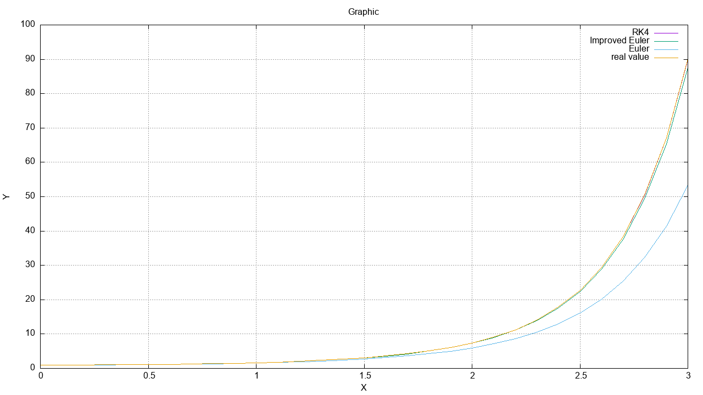
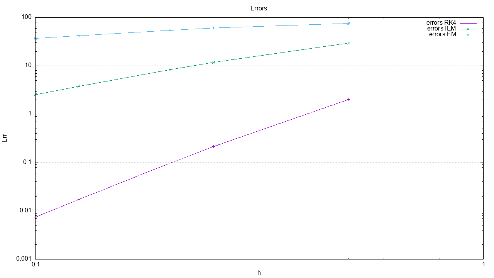

# Numerical Solution of an Ordinary Differential Equation in ANSI C

This project implements several numerical methods for solving an initial value problem (IVP) for an ordinary differential equation.

The solved equation is:

dy/dx = xy

with the initial condition:

y(0) = 1

The analytical solution is:

y = exp(x²/2)

## How to run

### Requirements

To run this project you need:

- GCC compiler
- Gnuplot (for generating plots)

### Compilation

Compile the program using:

```bash
gcc main.c -o solver -lm
```
### Execution

Windows:
```cmd
solver.exe
```

Linux/macOS:
```bash
./solver
```

The program will ask the user to provide:

- step sizes (`h`);
- the interval limits for `x`.

After execution, the generated data can be used to create the plots shown in the Results section.

## Implemented Methods

- Euler Method
- Improved Euler Method (Heun's Method)
- Classical Runge-Kutta Method of 4th order (RK4)

## Features

- Comparison between numerical and analytical solutions
- Calculation of absolute errors
- Error analysis for different step sizes
- Data export for plotting
- Visualization using Gnuplot

## Technologies

- ANSI C
- GCC Compiler
- Gnuplot

## Purpose

The goal of this project is to study the accuracy and behavior of different numerical methods for solving differential equations.

## Results

The plots below were generated using the numerical data produced by the solver.
The example output data used to create these graphs is available in the `examples` folder.

### Numerical solution comparison



### Error analysis

